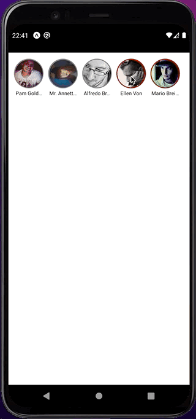

# react-native-story-component <!-- omit in toc -->

[](https://npmjs.com/package/react-native-story-component)
[](https://circleci.com/gh/ridvanaltun/react-native-story-component/tree/master)
[](http://commitizen.github.io/cz-cli/)
[](https://github.com/ridvanaltun/react-native-story-component/blob/master/LICENSE)

> A decent story component for React-Native

| Preview                                                           |
| ----------------------------------------------------------------- |
|  |

# Table of Contents <!-- omit in toc -->

- [Getting started](#getting-started)
- [Props](#props)
- [Usage](#usage)
- [Example App](#example-app)
- [Credit](#credit)
- [Contributing](#contributing)
- [License](#license)

## Getting started

```sh
npm i react-native-story-component
```

## Props

| Name                 | Description                              | Type                                             | Default Value |
| :------------------- | :--------------------------------------- | :----------------------------------------------- | :-----------: |
| data                 | Array of stories.                        | IUserStory[]                                     |               |
| unPressedBorderColor | Unpressed border color of profile circle | color                                            |      red      |
| pressedBorderColor   | Pressed border color of profile circle   | color                                            |     grey      |
| onClose              | Todo when close                          | (item: IUserStory) => void                       |     null      |
| onStart              | Todo when start                          | (item: IUserStory) => void                       |     null      |
| duration             | Per story duration in seconds            | number                                           |      10       |
| swipeText            | Text of swipe component                  | string                                           |   Swipe Up    |
| customSwipeUpButton  | Custom component for swipe area          | () => ReactNode                                  |               |
| customCloseButton    | Custom component for close button        | () => ReactNode                                  |               |
| customStoryList      | Custom component for story list          | (props: ICustomStoryList) => React.ReactNode     |               |
| customStoryView      | Custom component for story view          | (props: ICustomStoryView) => React.ReactNode     |               |
| customProfileBanner  | Custom component for profile banner      | (props: ICustomProfileBanner) => React.ReactNode |               |
| avatarSize           | Size of avatar circle                    | number                                           |      60       |
| showAvatarText       | Show or hide avatar text                 | bool                                             |     true      |
| showProfileBanner    | Show or hide profile banner              | bool                                             |     true      |
| textStyle            | Avatar text style                        | TextStyle                                        |               |
| storyListStyle       | Story list view style                    | ViewStyle                                        |               |

## Usage

```jsx
import Stories from 'react-native-story-component';

const App = () => {
  return (
    <Stories
      data={[
        {
          id: 1,
          avatar: 'https://randomuser.me/api/portraits/men/1.jpg',
          name: 'Marvin Lane',
          stories: [
            {
              id: 1,
              image: 'https://images.unsplash.com/photo-1510215744419-742d9dce947f?crop=entropy&cs=tinysrgb&fm=jpg&ixlib=rb-1.2.1&q=60&raw_url=true&ixid=MnwxMjA3fDB8MHxzZWFyY2h8NHx8MTA4MHgxOTIwfGVufDB8fDB8fA%3D%3D&auto=format&fit=crop&w=1200',,
              swipeText: 'Custom swipe text for this story',
              onPress: () => console.log('story 1 swiped'),
            },
            {
              id: 2,
              image: 'https://images.unsplash.com/photo-1493509094819-bd2d26fac21b?crop=entropy&cs=tinysrgb&fm=jpg&ixlib=rb-1.2.1&q=60&raw_url=true&ixid=MnwxMjA3fDB8MHxzZWFyY2h8M3x8MTA4MHgxOTIwfGVufDB8fDB8fA%3D%3D&auto=format&fit=crop&w=1200',
            },
          ],
        },
        {
          id: 2,
          avatar: 'https://randomuser.me/api/portraits/men/2.jpg',
          name: 'Manuel Weaver',
          stories: [
            {
              id: 1,
              image: 'https://images.unsplash.com/photo-1524821261922-e353d72c20e5?crop=entropy&cs=tinysrgb&fm=jpg&ixlib=rb-1.2.1&q=60&raw_url=true&ixid=MnwxMjA3fDB8MHxzZWFyY2h8Mnx8MTA4MHgxOTIwfGVufDB8fDB8fA%3D%3D&auto=format&fit=crop&w=1200',
              swipeText: 'Custom swipe text for this story',
              onPress: () => console.log('story 1 swiped'),
            },
            {
              id: 2,
              image: 'https://images.unsplash.com/photo-1590846083693-f23fdede3a7e?crop=entropy&cs=tinysrgb&fm=jpg&ixlib=rb-1.2.1&q=60&raw_url=true&ixid=MnwxMjA3fDB8MHxzZWFyY2h8MXx8MTA4MHgxOTIwfGVufDB8fDB8fA%3D%3D&auto=format&fit=crop&w=1200',
              swipeText: 'Custom swipe text for this story',
              onPress: () => console.log('story 2 swiped'),
            },
          ],
        },
      ]}
      duration={10}
      onStart={(openedStory) => {
        console.log(openedStory);
      }}
      onClose={(closedStory) => {
        console.log(closedStory);
      }}
      customSwipeUpButton={() => (
        <View>
          <Text>Swipe</Text>
        </View>
      )}
    />
  );
};
```

## Example App

```sh
# clone the project
git clone https://github.com/ridvanaltun/react-native-story-component.git

# go into the example folder
cd react-native-story-component/example

# install dependencies
npm i

# run for android
npm run android

# or

# run for ios
npm run ios
```

## Credit

I copied and rewrite the codebase from https://github.com/caglardurmus/react-native-insta-story in this project. I created this project because I was needed a better one.

## Contributing

See the [contributing guide](CONTRIBUTING.md) to learn how to contribute to the repository and the development workflow.

## License

MIT
